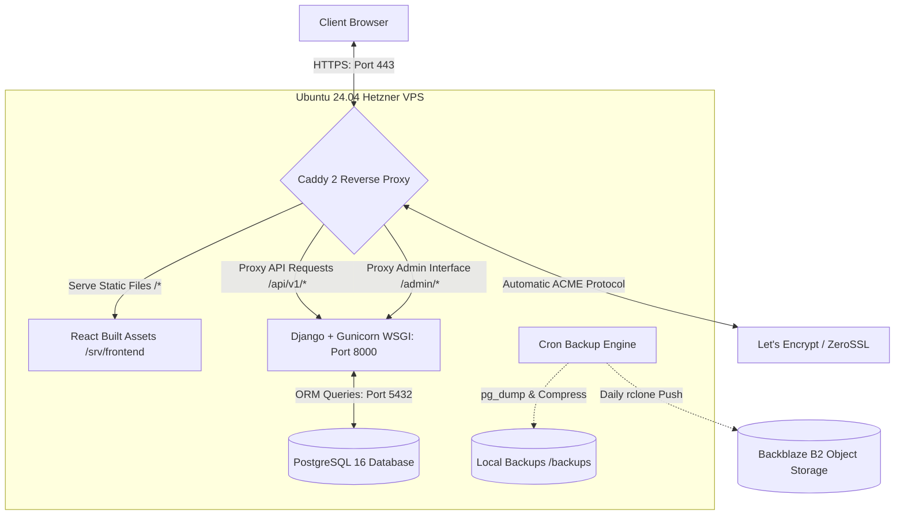
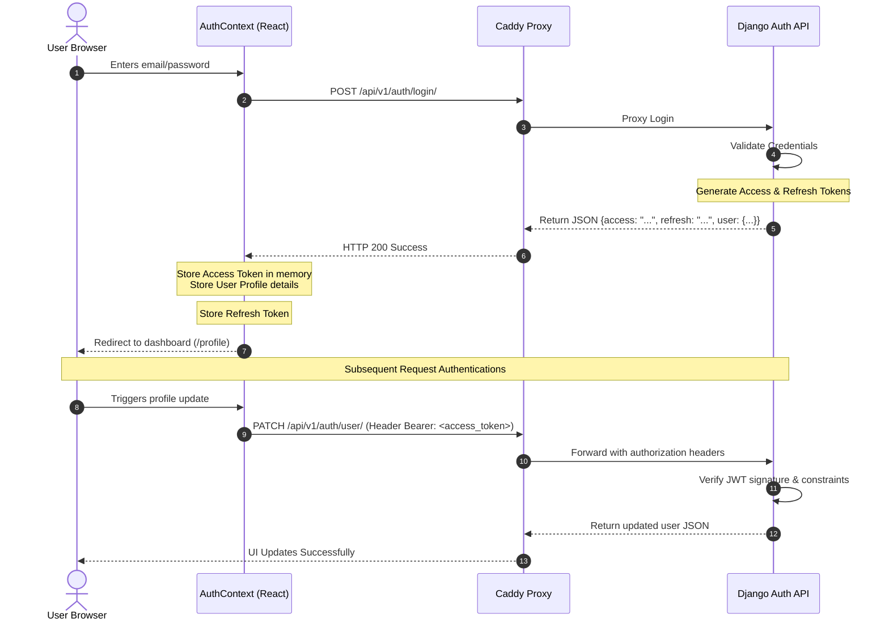
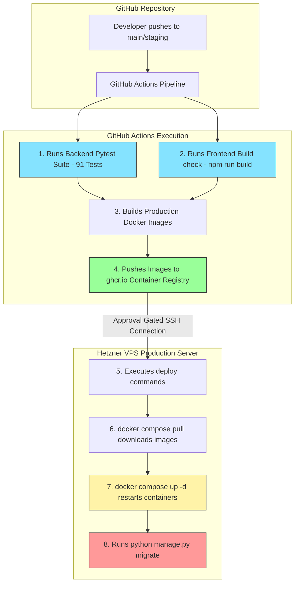

# Algonex Platform: Technical Architecture, Tech Stack & Dataflow

This document provides a comprehensive technical breakdown of the Algonex platform. It details the system architecture, internal codebase patterns, complete technology stack, and end-to-end dataflows for runtime operations and deployment.

---

## 1. System Architecture

Algonex is built using a decoupled, containerized client-server architecture designed to run on a single Hetzner VPS, optimized for performance, security, and extremely low operating costs (~$6/month).

### Production Runtime Architecture



### Key Architectural Concepts
1. **Zero-Process Frontend**: In production, the React frontend runs completely statically. There is no active Node.js server. Instead, Vite compiles the codebase into pure static files (`dist/`) during CI/CD. Caddy mounts this directory via a Docker volume and serves the files directly.
2. **Auto-SSL Reverse Proxy**: Caddy 2 automatically provisions, configures, and renews SSL certificates via Let's Encrypt / ZeroSSL. It acts as the gateway routing API traffic to the backend and assets to the client.
3. **Encapsulated Databases**: The PostgreSQL instance is isolated within a private Docker internal bridge network and cannot be accessed from the public internet.

---

## 2. Technology Stack

| Component | Technology | Version / Details | Purpose |
| :--- | :--- | :--- | :--- |
| **Frontend** | **React** | v19.1.1 | Reactive component UI framework |
| | **Vite** | v7.1.7 | Hot-reloading module bundler & build tool |
| | **Ant Design (antd)** | v5.27.4 | Enterprise-grade, sleek UI component library |
| | **Tailwind CSS** | v4.1.14 | Modern utility-first CSS framework |
| | **Framer Motion** | v12.38.0 | Interactive fluid micro-animations |
| | **React Router DOM** | v7.9.3 | Client-side routing, guards, and layout matching |
| **Backend** | **Django** | v5.2.x | High-performance Python web framework |
| | **Django REST Framework** | v3.15.x | RESTful API toolkit and serialization |
| | **Gunicorn** | Production WSGI | WSGI server hosting Python app process |
| | **dj-rest-auth / SimpleJWT** | JWT Authentication | Stateless JSON Web Token authentication |
| **Database** | **PostgreSQL** | v16 | Acid-compliant primary relational database |
| **Infrastructure** | **Docker & Compose** | v2 | Container orchestration & isolation |
| | **Caddy 2** | Production Proxy | HTTPS gateway, reverse proxy, static file server |
| | **rclone** | Cloud Backups | Command-line tool to sync backups to Backblaze |
| **CI/CD** | **GitHub Actions** | Automated Pipelines | Pytest suites, static code analysis, Docker builds, SSH deployment |
| | **ghcr.io** | Container Registry | Pushing and pulling versioned GitHub Packages |

---

## 3. Internal Application Architecture

Both codebases adhere to modular, maintainable architectural design patterns.

### Backend: 4-Layer Architecture
Each Django app (e.g., `accounts`, `courses`, `events`, `careers`, `portfolio`) is structured using a strict **4-layer architectural pattern** to decouple database models from presentation views:

1. **Model Layer (`models.py`)**: Defines the relational schema, constraints, indexes, and Django ORM definitions.
2. **Selector Layer (`selectors.py`)**: Encapsulates all query/read operations. Prevents raw ORM filters from leaking into views.
3. **Service Layer (`services.py`)**: Handles all write operations, business logic rules, transactional state mutations, and external API requests.
4. **View/Serializer Layer (`views.py` & `serializers.py`)**: Manages HTTP request parsing, input validation via DRF Serializers, endpoint routing, and JSON formatting.

### Frontend: React Directory Structure
```
algonex-frontend/src/
├── api/             # Axios API client instances and endpoint modules
├── assets/          # Static images, SVG resources, and fonts
├── components/      # Modular component layouts
│   ├── chat/        # Global Buddy AI Chatbot
│   ├── common/      # Protected Route guards, Error Boundaries
│   ├── courses/     # Learning Roadmaps, Course Cards
│   ├── home/        # Dynamic landing page sections
│   └── Pages/       # Static high-level page views
├── context/         # AuthContext providing JWT session states
├── hooks/           # Custom React hooks (useAuth, etc.)
├── pages/           # Client-side routed view pages (auth, profile, programs)
├── theme/           # Ant Design global design tokens and custom variables
├── App.jsx          # Router paths and main app skeleton
└── main.jsx         # Document root bootstrap
```

---

## 4. End-to-End Dataflows

### 1. Typical Page Load & Read API Dataflow
When a user clicks on a course (e.g., `/courses/python-bootcamp`):

```
[Browser] ──(1. Navigates to Route)──> [React Router DOM]
                                            │
                                    (2. Mounts CourseDetailPage)
                                            │
                                            ▼
[Browser] <──(3. Triggers useEffect API Request)── [Axios Client]
    │                                                   │
 (HTTPS GET /api/v1/courses/python-bootcamp/)           │
    │                                                   ▼
    ├──> [Caddy Gateway] ──(4. Proxies to Port 8000)──> [Gunicorn / Django]
                                                            │
                                                     (5. Route Handler)
                                                            │
                                                            ▼
                                                        [DRF View]
                                                            │
                                                    (6. Selector Query)
                                                            │
                                                            ▼
 [PostgreSQL 16] <──(7. Executes SELECT Query)─── [Selector Layer]
    │
 (Returns record)
    │
    ▼
 [Serializer] ──(8. Validates & Converts to JSON)
    │
    ▼
 [Gunicorn] ──(9. HTTP 200 JSON Success Response)──> [Caddy] ──> [Axios Client]
                                                                        │
                                                            (10. setCourse(data))
                                                                        │
                                                                        ▼
                                                            [React Renders UI]
```

### 2. User Authentication Dataflow (JWT)
Algonex utilizes stateless, secure JSON Web Tokens (JWT) for user sessions:



---

## 5. Deployment Pipeline (CI/CD)

Deployments are automated through a secure, gated GitOps workflow:


